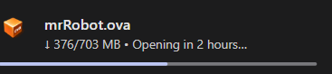

# Day 1
## Date 24th September 2026
**So today i started doing this daily challenge I'm thinking of doing a virtal Machine an OVA File present in the VulnHub Platform***

**Task 1: Mr-Robot: 1**   **Date Release: 28 Jun 2016**   **Author: Leon Johnson**  
**Description:** Based on the show, Mr. Robot. 
This VM has three keys hidden in different locations. Your goal is to find all three. Each key is progressively difficult to find. 
The VM isn't too difficult. There isn't any advanced exploitation or reverse engineering. The level is considered beginner-intermediate.  

***As shown the file is still not installed yet even though it's just 700+MB*** 

**So unfortunaterly the dowloading of the lab was unsuccesful so didnt do the above lab instead did something below**  
I think of reseaching learning about new attacks that happened instead 

