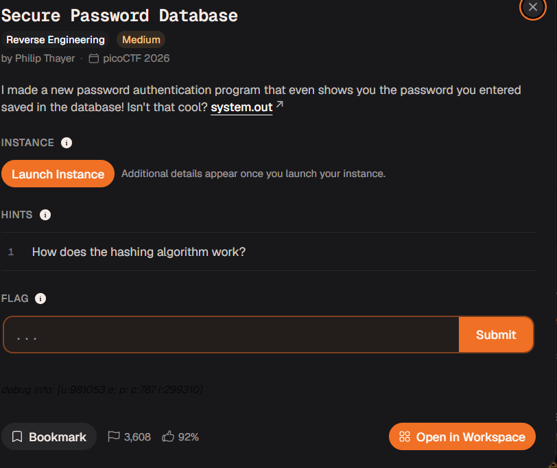

# Day 6 — Date : 29/09/26

## What Happened
This is  usually not the time I write, because its 1:55pm right now . I usually write in the night after writing something. need to look into soemthing I will do today or now in present. Currently its 2hrs of free hour and was bored af so thought of doing this instead. Then CENT exam is this week and I've not done anything So think of doing a bit of research on that. Anyway My semeinar was today and it got over finally after countless scheduling conflicts and delays. 
I'm currently in a conflict about something I've registered for GATE exam (Enterence Exam for doing Post Graduation) and an online tutoring class is about to happen for it and its cost is a bit higher than expected. And also a workshop which i would like to go for but there are no participenats so probably get cancelled so no worry in that. 

Its beedn long since I've done some task form cylab so lets do that.
---

## Objective
**Secure Password Database** 
**Type : Reverse Engineering**  
**Difficulty : Medium** 
**by Philip Thayer** 

**Description**
I made a new password authentication program that even shows you the password you entered saved in the database! Isn't that cool?

[Link_to the challnge](https://learn.cylabacademy.org/library/767?page=1&category=3&difficulty=2)
---

## What I Did
So found a taks in Scilabs as lisued above it was cool and fun to do it was good. It is of the medium difficulty in Riverse Engineering catagory seems good
---

## What I Learned
So this was my first actual time using ghidra and gave me a good understanding how the working and the fuctions are. Also introduced me to the tool called gdb which is something used in RE and helps finding the expected output and is pretty cool
---

## Tools Used
- Ghidra
- GDB
- 
---

## Challenges
- Mentioned detailed in the writeup

---

## Proof of Concept
- Check [Here](./Secure_Password_Database_writeup.md)
---

## Resources
- [Medium Post](https://medium.com/@alligraphic/secure-password-database-writeup-picoctf-2026-ef7cf182983a)

---

## Metrics
- **Time spent:** 20 minutes max
- **Task:** Complete 
- **Status:** ✅ Complete 

## Fututre tasks
- Currently Nothing to do though there are some labs and courses freen on ec-council which i would love to tryout later 
