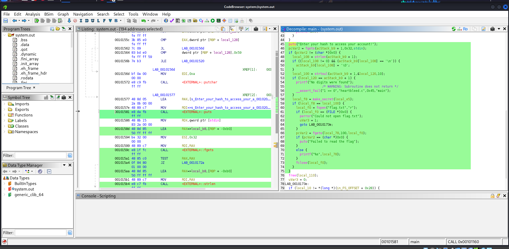
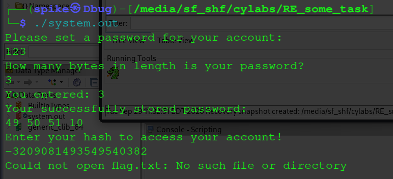

# Secure Password Database Writeup

> **I made a new password authentication program that even shows you the password you entered saved in the database! Isn't that cool?**
---
## Category: Reverse Engineering 
## Difficulty: Medium(Though it was easy for me to once the idea was clear)
## Description

We are given a .out file and the flag is present inside it.
---
## Objective
**Secure Password Database**<br>
**Type : Reverse Engineering** <br>
**Difficulty : Medium**<br>
**by Philip Thayer**<br>

---
## walkthrough
### Step 1 :
- The given out file is being downladed using the wget command or just download normally
- thought it might be different but not


---
- After Downloading open the file in ghidra and decompile the code

---


---

- Analyzing the given code above whe de code about the make_secret() fuction analyzing it forther gives more details 

---


---
- In  the program there seem to be a value called off_byte checking it futher gives a hexadecimal values gives us the hashing code after hashing it down  which is 

```text
-3209081493549540382
```

- Now that we recieved that we can finally get the flag and so i thought but it leaded in failure as shown in the SS below

---

---
- Apparently it could only be found using the instance in the website so used nc to find it and finally found the flag
---


```text
academy{d0nt_trust_us3rs}
```